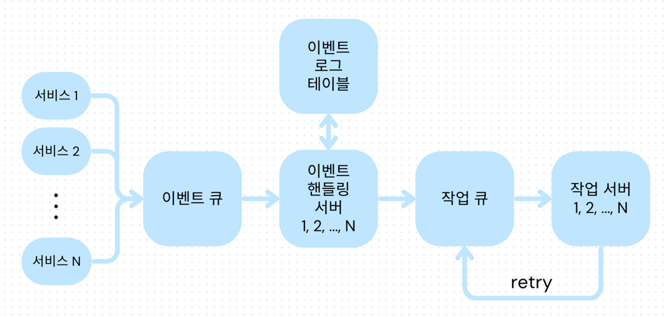

<h1>김성호</h1>

안녕하세요. 백엔드 엔지니어 김성호 입니다.

  

<h1>💻 Career Summary</h1>

  <h2>Laplace Technologies, Inc.</h2>
  
<strong>Backend Engineer</strong> 2021.06 - 

  <h3>대시보드 API 서버 구축</h3>
  
  
<strong>Description.</strong> 
  500개 이상의 커머스 BI 데이터 지표에 대해 분석 및 시각화 하는 대시보드 API 서버를 설계 및 구축
  

  
  
<strong>What did I do.</strong>

  <ul>
    <li>대시보드 설정 정보를 요청 받아 데이터를 집계하여 제공하는 서비스 구현</li>
    <li>API 서버 및 분산 쿼리 시스템의 단위별 캐싱을 통해 대시보드 조회 성능 개선</li>
    <li>대시보드를 커스텀하게 다룰 수 있도록 document 기반의 CRUD 기능 구현</li>
  </ul>
  
  
<strong>Tech Stack.</strong> FastAPI, Trino, Redis, Kubernetes, Python

  

  <h3>알림 시스템 구축</h3>
  
  
<strong>Description.</strong> 
  일 평균 1300개 이상의 커머스 BI 리포트 및 CRM 메시지를 발송하는 알림 시스템을 구축 
  

  
  
<strong>What did I do.</strong>

  <ul>
    <li>메시지 큐를 이용한 이벤트 드리븐 기반의 알림 전송 시스템 구축</li>
    <li>설정 정보를 통해 대시보드 API를 호출하고 리포트를 생성하는 서비스 구현</li>
    <li>카카오 알림톡, 슬랙, 이메일 전송 서비스 구현</li>
  </ul>
  
  
<strong>Tech Stack.</strong> AwsSQS, Airflow, FastAPI, AwsLambda, MySQL, Redis, Kubernetes, Python

  

  <h3>커머스 데이터 파이프라인 구축</h3>
  
  
<strong>Description.</strong> 
   
  400개 이상의 고객사를 대상으로 쇼핑몰, 광고 플랫폼, 웹로그 등의 커머스 관련 데이터를 처리하는 ETL 파이프라인을 구축하여 일 평균 200만 개의 데이터를 처리
  

  
  
<strong>What did I do.</strong>

  <ul>
    <li>Airflow를 이용해 파이프라인 스케줄링 Dag 개발</li>
    <li>Spark 및 Trino 최적화를 통해 처리 성능 향상(대략 20%이상의 데이터 처리 비용 절감)</li>
    <li>데이터 품질 및 쿼리 성능 향상을 위한 데이터 웨어하우스 구축</li>
  </ul>
  
  
<strong>Tech Stack.</strong> Airflow, Spark, Trino, Iceberg, Deltalake, AwsS3, Kubernetes, Python, Java

  
  

  <h3>서드파티 권한 인증 서버 구축</h3>
  
  
<strong>Description.</strong> 
  쇼핑, 광고, 웹로그를 다루는 외부 플랫폼의 데이터를 수집하기 위해 권한 및 인증 정보를 제공 받는 서버를 구축  
  

  
  
<strong>What did I do.</strong>

  <ul>
    <li>Oauth, API key, Crawling 등의 방법으로 유저로 부터 권한을 제공 받는 서비스 구현</li>
    <li>인증 정보를 암호화 후 저장</li>
    <li>인증 정보 만료 시 대응 로직 구현</li>
  </ul>
  
  
<strong>Tech Stack.</strong> FastAPI, MySQL, AwsSecretManager, Kubernetes, Python

  

  <h3>유지보수 및 모니터링</h3>
  
  
<strong>Description.</strong> 
  개발 경험 향상을 위해 배포 파이프라인 및 모니터링 시스템을 구축
  

  
  
<strong>What did I do.</strong>

  <ul>
    <li>GitAction, ArgoCD 기반의 CI-CD 파이프라인 구축</li>
    <li>PagerDuty 및 Sentry 기반의 에러 모니터링 시스템 구축, API 서버와 1만개 이상의 Airflow task의 Failure를 모니터링</li>
  </ul>
  
  
<strong>Tech Stack.</strong> GitAction, ArgoCD, Helm, Kubernetes, PagerDuty, Sentry

  <h2>NC Lab    숭실대학교 </h2>
  
<strong>학부 연구생</strong> 2020.07 - 2021.06

  <h3>IOT 센서 데이터 파이프라인 구축</h3>
  
  
<strong>Description.</strong> 
  IOT 센서 클러스터들이 제공하는 다양한 데이터를 처리하는 ETL 파이프라인 구축
  

  
<strong>What did I do.</strong>

  <ul>
    <li>센서 데이터를 스트리밍 하기 위한 Kafka 세팅</li>
    <li>데이터를 전처리하고 ElasticSearch, MySQL에 적재하는 서버 구현</li>
  </ul>
  
  
<strong>Tech Stack.</strong> Kafka, ElasticSearch, Go, MySQL, Docker

  

<h1> 🎒 Personal Experience </h1>

<h3> 숭실대학교 </h3>

<strong>AI 융합학부생 (2017.03 ~ 2022.06)</strong>

- 평균 학점: 4.1/4.5

<strong>NCLab 학부 연구생 (2020.07 ~ 2021.06)</strong>

<h3> 해군 1함대 사령부 정보통신 중대 </h3>

<strong>전산 · 네트워크병 (2017.08 ~ 2019.06)</strong>

  

# Leading Projects

  <h2>Laplace Technologies, Inc.</h2>

<h3> 대시보드 API 리팩토링 </h3>

<strong>Problems.</strong>

<ul>
  <li>대시보드의 데이터 종류 및 분석 방법 마다 각기 다른 API로 구현되어있음</li>
  <li>일관성이 없어 코드의 가독성이 떨어지며, 유지보수 및 추가 개발이 어려움</li>
  <li>변경 소요가 너무 커서 고객의 신규 요구사항을 반영하는데 많은 시간이 걸림</li>
</ul>

<strong>Solutions.</strong>

<ul>
  <li>모든 대시보드 API가 하나의 컴포넌트에서 관리될 수 있도록 리팩토링</li>
  <li>계층 및 인터페이스를 분리한 후 추상화 전략을 고도화</li>
<ul>
  <li>QueryLayer: 데이터 서버에 보낼 요청을 생성 및 반환(쿼리 혹은 ApiRequest)</li>
  <li>DataLayer: QueryInterface가 생성한 요청을 데이터 서버에 전달하여 결과 데이터 반환</li>
  <li>DashboardLayer: DataInterface가 반환한 데이터를 후집계 및 대시보드 규격에 맞추어 처리하고 최종 결과 반환</li>
</ul>
  <li>data_source, measure, dimension, filter, time_frequency 등을 전부 커스텀하게 요청 받아 이에 맞는 집계 데이터를 반환 하도록 구성</li>
  <ul> 
    <li>추상 메서드를 잘 Implement한 서비스를 생성하고, 요청에 따라 각 서비스들을 조립 및 재사용 해가며 실행할 수 있도록 구성</li>
    <li>사내 분산 쿼리 엔진(=Trino), 고객사의 BigQuery, GA4의 API 서버 등 각각 다른 서버에 위치한 데이터를 하나의 데이터 처럼 집계 요청 가능</li>
    <li>디테일한 필터링을 지원할 수 있도록 필터의 형태를 Tree 구조로 구성</li>
  </ul>
</ul>

<strong>Results.</strong>

<ul>
  <li>각 layer의 관심사를 분리하고 의존도를 낮추어 유지보수 용이성이 향상</li>
  <li>데이터 종류, 측정값, 분석단위, 필터, 분석방법 등의 커스텀한 설정값을 받아서 이에 맞는 집계 결과를 반환하는 커스텀 대시보드의 API로 활용</li>
  <li>추후에 `4분면 분석`, `ABC 분석` 등의 추가 기능이 요구되었지만, 하위의 공통 Layer만 수정하면 됐을 정도로 개발 용이성 및 고객 만족도 확보</li>
</ul>

<h3> 대시보드 API 로딩 속도 개선 </h3>

<strong>Problems.</strong>

<ul>
  <li>대시보드 API 호출 시 데이터의 양이 많아 30초 이상의 시간이 소요되어 Timeout 발생</li>
  <li>사용자의 활용 경험에 매우 큰 악영향을 주는 문제로 지적됨</li>
  <li>단순히 분산 쿼리 엔진인 Trino의 스펙을 높여서 성능을 개선할 수 있었지만, 이는 클라우드 컴퓨팅 자원의 비용 상승으로 이어짐</li>
</ul>

<strong>Solutions.</strong>

<ul>
  <li>계층 별 캐싱 전략 도입</li>
  <ul>
  <li>API 서버 캐싱</li>
  <ul>
  <li>Redis를 활용하여 요청 단위로 집계 결과를 캐시하도록 설정</li>
  <li>중복된 요청이 발생했을 때에도 캐싱된 결과를 반환하도록 설정하여, 쿼리 엔진으로 전달되는 쿼리량과, 분석 시간을 대폭 절감</li>
  </ul>
  <li>분산 쿼리 엔진 캐싱</li>
  <ul>
  <li>고객들이 생성한 대시보드 종류의 통계를 보았을 때 동일한 데이터 소스에 다양한 집계를 설정한 다수의 차트를 하나의 대시보드에 위치 시키는 경향을 확인</li>
  <li>Trino가 S3 스토리지에서 읽어온 데이터를 로컬 스토리지에 캐시하도록 설정</li>
  <li>이로 인해 S3에서 Trino로의 데이터 전송 비용 및 처리 시간을 대폭 절감</li>
  </ul>
  </ul>
  <li>적절한 Cache Eviction</li>
  <ul>
  <li>사용자의 데이터가 업데이트 될 경우 캐시된 데이터로 인해 데이터의 일관성에 문제가 생길 수 있음</li>
  <li>사용자 데이터 업데이트 이벤트를 리스닝하는 핸들러에 해당 사용자의 업데이트된 데이터 관련 캐시를 모두 Eviction하도록 하여 데이터의 일관성 확보</li>
  </ul>
</ul>

<strong>Results.</strong>

<ul>
  <li>Trino로 전달되는 쿼리 요청 수가 50% 이상 크게 감소</li>
  <li>Grafana 확인 결과 대시보드 API의 평균 응답 속도를 5초 이내로 단축</li>
  <li>사용자의 대시보드 활용 경험을 크게 개선</li>
  <li>인프라 비용의 증가 없이 성능 최적화를 달성할 수 있었음</li>
</ul>

<h3> AWS Elastic Kubernetes Service 최적화 </h3>

<strong>Problems.</strong>

<ul>
  <li>Kubernetes 클러스터에서 EKS와 EC2를 함께 사용하면서 Pod 수 증가에 따라 자동으로 EC2 노드가 스케일링 되고 있었음</li>
  <li>Airflow on Kubernetes를 사용 중이었으며, 이 때 과도한 Task들로 인해 다수의 Pod가 생성됨</li>
  <li>EC2 노드의 스케일업이 빈번히 발생하여 불필요한 비용이 발생</li>
</ul>

<strong>Solutions.</strong>

<ul>
  <li>Prometheus로 집계된 리소스 사용률을 Grafana를 이용해 확인한 결과 할당된 리소스 크기에 비해 CPU 사용량이 매우 낮은 다수의 tiny task들이 각각 pod로 생성되는 것이 잦은 스케일 업의 원인임을 확인</li>
  <li>여러 tiny task들을 하나의 task로 chaining 시키거나, 불필요한 dynamic task mappning을 정리하는 등 Airflow의 task를 최적화하여 pod가 과도하게 생성되는 것을 방지</li>
  <li>Task가 실행될 때 최소한의 리소스만 할당하도록 조정</li>
  <li>Karpenter를 Kubernetes의 스케줄러로 도입</li>
  <ul>
    <li>Pod의 리소스 요구 사항과 노드의 리소스 사용률을 기반으로 노드를 동적으로 할당하여, 리소스 낭비를 줄이고 불필요한 노드 스케일링을 방지할 수 있었음</li>
    <li>노드 리소스 사용률이 낮을 때 유휴 노드를 자동으로 축소하고, 반대로 리소스가 과부하될 때는 필요한 만큼만 노드를 확장하여 클러스터를 최적화</li>
  </ul>
</ul>

<strong>Results.</strong>

<ul>
  <li>Pod 배치가 보다 효율적으로 이루어져 리소스 사용률과 클러스터 효율성 개선</li>
  <li>billing report 확인 결과 EC2 비용을 약 20% 절감할 수 있었음</li>
  <li>서비스 운영에 타격을 주지 않고 인프라 운영 비용을 절감하는데 성공</li>
</ul>

<h3> 알림 시스템 설계 및 구축 </h3>

<strong>Problems.</strong>

<ul>
  <li>기존 알림 기능의 파편화</li>
  <ul><li>각 task의 콜백으로 추가되고 있었음</li></ul>
  <li>일별 BI 리포트 발송 기능 추가 요구</li>
</ul>

<strong>Solutions.</strong>

<ul>
  <li>이벤트 드리븐 시스템 도입</li>
  <ul>
  <li>Tasks에서 생성한 각종 이벤트에 따른 작업들을 수행</li>
  <li>이벤트 큐, 핸들러와 작업 큐, 핸들러를 구분하여 책임 및 관심사 분리</li>
  </ul>

  
  
  <li>알림 시스템 구축</li>
  <ul>
  <li>전송 주기, content, 전송 대상 등의 설정을 기반으로 알림 스케줄</li>
  <li>스케줄된 시간에 알림 생성 및 전송</li>
  </ul>

  
  <li>커스텀 리포트</li> 
  <ul>
    <li>알림 설정 테이블</li>
    <ul><li>사용자가 받고자 하는 알림의 설정 정보를 커스텀 하게 등록</li></ul>
    <li>이벤트 핸들링 서버</li>
    <ul><li>이벤트 큐에서 사용자의 일별 배치 작업 완료 이벤트를 읽어 핸들러 실행(알림 생성 command를 작업 큐에 produce)</li></ul>
    <li>작업 서버</li>
    <ul><li>작업 큐를 읽어 알림 설정 테이블의 정보를 기반으로 알림을 스케줄</li></ul>
    <li>알림 서버</li>
    <ul>
    <li>알림 스케줄 테이블에서 스케줄 조건을 만족하는 row를 읽어 알림을 생성한 후 알림 전송 command를 작업 큐에 produce</li>
    <li>알림 생성 시 설정한 content 정보를 기반으로 알림 서버에서 대시보드 서버에 집계요청 후 BI 리포트 생성</li>
    </ul>
    <li>작업 서버</li>
    <ul><li>작업 큐로 부터 전달 받은 알림 내용을 목적지로 전송 </li></ul>
  </ul>
  <li>각종 큐는 AwsSQS로 구성</li>
  <ul>
    <li>최소 스펙의 Kafka 브로커 3대를 cloud 환경에서 운용할 경우 매월 약 600$의 비용 발생</li>
    <li>실제 발생하는 이벤트량에 비해 오버스펙이라 판단했고, 합리적인 비용 지출을 위해 SQS로 선정</li>
  </ul>
</ul>

<strong>Results.</strong>

<ul>
  <li>각종 이벤트 드리븐 기능의 개발 및 유지보수 용이성 확보</li>
  <ul>
  <li>이벤트 핸들러 추가, 커맨드 핸들러 추가 등의 간단한 작업 만으로 파편화 되어있던 다른 기능들도 간단하게 마이그레이션</li>
  </ul>
  <li>고객 대상 설문조사 결과, 유료 구독 전환을 결정하게 되는 주요 기능 중 하나로 자리 잡음</li>
  <li>billing report 확인 결과 모든 메시지 큐의 월 비용 합계는 3$ 이내로, 최소한의 인프라 비용으로 정상 작동하는 시스템 구현 성공</li>
</ul>

